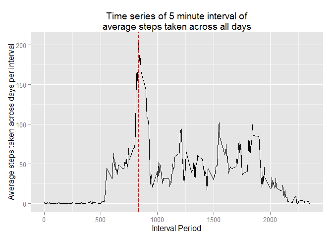

# Reproducible Research: Peer Assessment 1


## Part 1: Loading and preprocessing the data

```r
rm(list=ls())
fileurl <- "https://d396qusza40orc.cloudfront.net/repdata/data/activity.zip"
# extract base name of file from url e.g. myfile.csv
filesaved <- basename(fileurl)
# Only download file if file does not exist in folder
if(!file.exists(filesaved))
        {download.file(fileurl,destfile=filesaved,mode="wb")}
unzip(filesaved, overwrite = TRUE)
mydata <- read.csv('activity.csv')
```
## Part 2: What is mean total number of steps taken per day?

```r
library(data.table)
## Change to data table
mydata <- data.table(mydata)
## Change 'date' column from factor to date class
mydata <- mydata[, date:=as.Date(date)]
## Remove any rows with NA
cleandata <- na.omit(mydata)
## Sum the total steps per day using cleandata
stepperday <- cleandata[,list(totalsteps=sum(steps)), by='date']
## Calculate mean and median
meantotalsteps <- mean(stepperday$totalsteps)
mediantotalsteps <- median(stepperday$totalsteps)

## Histogram of Total Steps Per Day, median and mean
hist(stepperday$totalsteps, main="Histogram of Total Steps Per Day",
     xlab="Total Steps Per Day", col="red", breaks=60)
abline(v=meantotalsteps, col="green", lwd=3)
abline(v=mediantotalsteps, col="blue", lwd=3, lty=2)
```

 

```r
print(paste0("The mean of total steps per day is ", meantotalsteps))
```

```
## [1] "The mean of total steps per day is 10766.1886792453"
```

```r
print(paste0("The median of total steps per day is ", mediantotalsteps))
```

```
## [1] "The median of total steps per day is 10765"
```
## Part 3: What is the average daily activity pattern?

```r
meanstepperinterval <- cleandata[,list(meanstepsint=mean(steps)), by='interval']
## Initializing library for ggplot2
## install.packages("ggplot2")
library(ggplot2)
## 1. Time series plot of the 5 minute interval of average steps taken across all
## days
plottitle1 <- paste0("Time series of 5 minute interval of\n",
                     "average steps taken across all days")
plot1 <- ggplot(meanstepperinterval, aes(interval, meanstepsint))+geom_line() +
        xlab("Interval Period") +
        ylab("Average steps taken across days per interval") +
        ggtitle(plottitle1)

## 2. Which 5 minute interval, on average across all days,
## contains max nr of steps
maxinterval<-meanstepperinterval$interval[
        which.max(meanstepperinterval$meanstepsint)]
plot1 + geom_vline(xintercept=maxinterval, color="red", linetype="longdash")
```

 

```r
ans2 <- paste0("Which 5 minute interval contains max number of average ",
               "steps across all days?\nAnswer = ", maxinterval)
writeLines(ans2) 
```

```
## Which 5 minute interval contains max number of average steps across all days?
## Answer = 835
```

## Part 4: Imputing missing values

```r
## Total number of rows with NA in dataset
paste0("Total number of rows with NA in dataset is ",sum(is.na(mydata)))
```

```
## [1] "Total number of rows with NA in dataset is 2304"
```

```r
## Filling in all of the missing values in the dataset
## Use mean of steps per interval across all days
impdata <- mydata
## Convert from integer to numeric
impdata <- impdata[, steps:=as.numeric(steps)]
## Replace NA with mean steps per interval from meanstepperinterval data frame
## New dataset is called impdata
impdata[is.na(steps),]$steps <- meanstepperinterval$meanstepsint

## Sum the total steps per day using cleandata
impstepday <- impdata[,list(totalsteps=sum(steps)), by='date']
## Calculate mean and median
impmeantotalsteps <- mean(impstepday$totalsteps)
impmediantotalsteps <- median(impstepday$totalsteps)

## Histogram of Total Steps Per Day, median and mean
hist(impstepday$totalsteps, main="Histogram of Total Steps Per Day (Imputed)",
     xlab="Total Steps Per Day", col="red", breaks=60)
abline(v=impmeantotalsteps, col="green", lwd=3)
abline(v=impmediantotalsteps, col="blue", lwd=3, lty=2)
```

 

```r
print(paste0(
        "The mean of imputed data of total steps: ", impmeantotalsteps))
```

```
## [1] "The mean of imputed data of total steps: 10766.1886792453"
```

```r
print(paste0(
        "The median of imputed data of total steps: ", impmediantotalsteps))
```

```
## [1] "The median of imputed data of total steps: 10766.1886792453"
```

```r
summary(impstepday)
```

```
##       date              totalsteps   
##  Min.   :2012-10-01   Min.   :   41  
##  1st Qu.:2012-10-16   1st Qu.: 9819  
##  Median :2012-10-31   Median :10766  
##  Mean   :2012-10-31   Mean   :10766  
##  3rd Qu.:2012-11-15   3rd Qu.:12811  
##  Max.   :2012-11-30   Max.   :21194
```

```r
summary(stepperday)
```

```
##       date              totalsteps   
##  Min.   :2012-10-02   Min.   :   41  
##  1st Qu.:2012-10-16   1st Qu.: 8841  
##  Median :2012-10-29   Median :10765  
##  Mean   :2012-10-30   Mean   :10766  
##  3rd Qu.:2012-11-16   3rd Qu.:13294  
##  Max.   :2012-11-29   Max.   :21194
```
The imputation of missing data (NA) steps is based on the filling with the mean number of steps per 5-minute interval across all days.

Based on data above there is very little difference on mean/median between Part 1 of assignments with this Part 3 of assignment. The impact of imputing missing data is having missing days being filled up i.e. 2012-10-01 and slight shift in histogram between two diagrams (part 1 and part 3).

## Part 5: Are there differences in activity patterns between weekdays and weekends?

```r
## install.packages("timeDate")
library(timeDate)
## Create new column datetype to show if it is weekday or weekend
impdata$datetype <- factor(isWeekday(impdata$date), labels=c("weekend", "weekday"))
## Verification code to check if above labels is correct
impdata$dayofweek <- weekdays(impdata$date)
## New data set with mean of steps across days grouped by datetype and interval
impmeanstepint <- impdata[,list(steps=mean(steps)), by=c('interval','datetype')]

## Create Plot2
plottitle2 <- paste0("Time series of 5 minute interval of\n",
                     "Average steps taken across all days\n",
                     "Group by weekend and weekdays")
plot2<-ggplot(impmeanstepint,aes(interval, steps))+geom_line()+
        xlab("Interval Period") +
        ylab("Average steps taken across days per interval") +
        facet_wrap(~ datetype, ncol=1) +
        ggtitle(plottitle2)
print(plot2)
```

 

The activity patterns are fairly similar between weekdays and weekends. It seems weekday around 0800-0900 period that there is slightly higher average steps compared to weekend.
